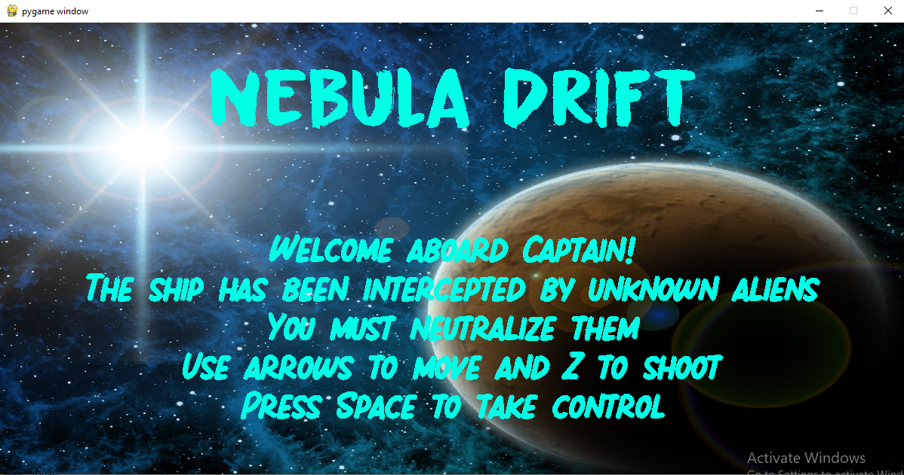
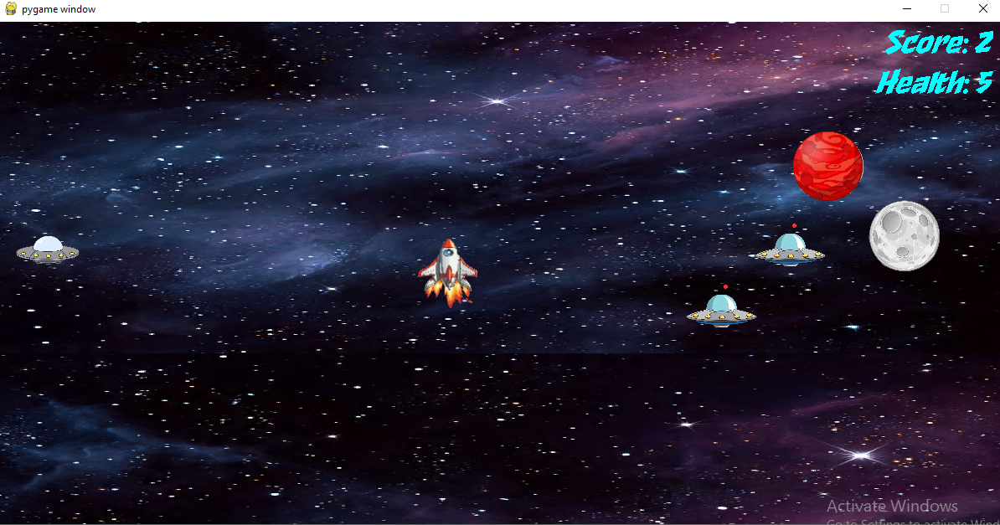
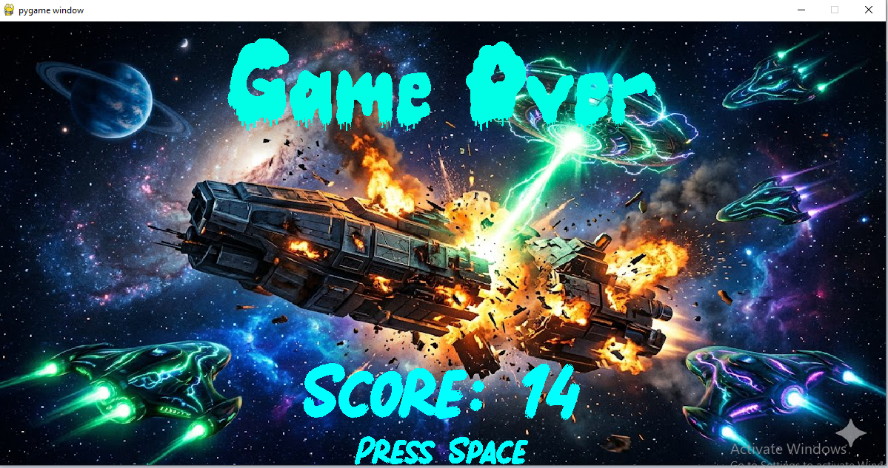

# <h1 align = 'center'>Nebula Drift : A Space shooter game using Python</h1>
Nebula drift is an endless space shooter game developed using the pygame package offered by python. The player controls a spaceship using the arrow keys
and shoots torpedoes using the 'Z' key. The player must avoid colliding into planets and the enemy UFOs. Doing so costs the player a health point. At the same time
he must shoot down as many of the enemy UFOs as he can. There are 5 health points initially. However, there are health collectibles, collecting which awards him a health
point. The game is endless in both forward and backward. That means, the player can travel front and back endlessly. The player has the flexibility to shoot in 8 directions,
Front(north) back(south), east(right) , west(left), north-east(45 degrees to positive X axis), north-west(135 degrees to positive X axis), south-east(-45 degrees to positive x X axis)
and south-west(-135 degrees to positive X-axis). The player dies once health points reach 0.

  
  
  

[Gameplay video](https://www.youtube.com/watch?v=TCx1gFa2yt4)
